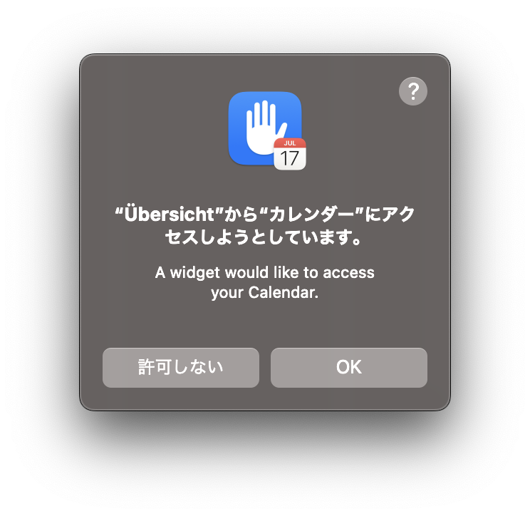
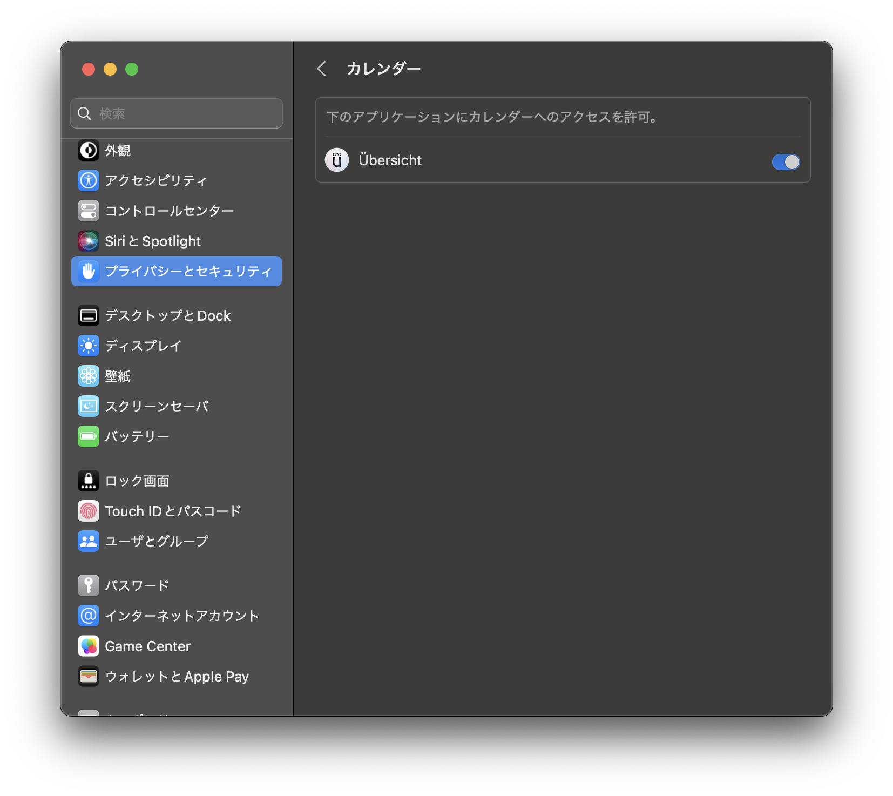

# Calendar
This is a Übersicht widget that displays your calendar. It allows you to display the events of calendar managed by Mac Calendar App on your desktop.

## Screen Shot
### Nomal Mode

### Minimize Mode

## Prerequisites
 - [Übersicht](http://tracesof.net/uebersicht/)
 - Mac computers with Apple silicon (Because of build environment for icc)
 - Calendar Access Authorization

## Getting Started
### 1. Open Widgets folder
 > Select open `Open Widgets folder` from the Übersicht menu in the top menu bar.

### 2. Move the widget to Übersicht widget folder
 > Drag and drop to set in the Übersicht widget folder.

### 3. Calendar Access Permission

 > A dialog box will appear asking you to confirm that you want to allow access to the calendar. Click `OK` to allow access.

 \* It appears to be accessed from Übersicht, but it is the CLI program I have created that actually accesses it. It is `icc` in /calendar.widget/bin.

### 4. Configure widget possition
 > Adjust widget possition as needed.

## Revocation of Access Permission

If you want to revoke access to this widget, please go to `System Settings` -> `Privacy and Security Settings` -> `Calendar` to disable access privileges.

## Third Party Libraries or materials
This widget incorporates and uses the following libraries or materials.

 - [リロード、やり直しのアイコン (ICOOON MONO)](https://icooon-mono.com/11971-%E3%83%AA%E3%83%AD%E3%83%BC%E3%83%89%E3%80%81%E3%82%84%E3%82%8A%E7%9B%B4%E3%81%97%E3%81%AE%E3%82%A2%E3%82%A4%E3%82%B3%E3%83%B3/)
 - [Box, minimize, close icon (Erik Ragnar Eliasson)](https://www.iconfinder.com/icons/623091/box_minimize_close_delete_minus_remove_substract_icon)
 - [Window, maximize icon (Font Awesome)](https://www.iconfinder.com/icons/8542583/window_maximize_icon)

## Support

